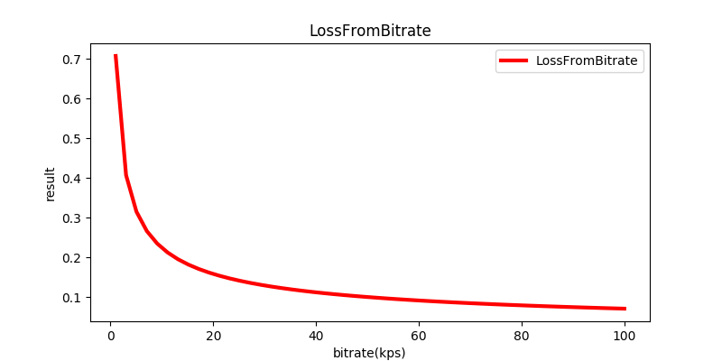
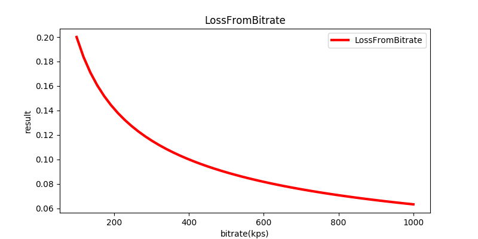
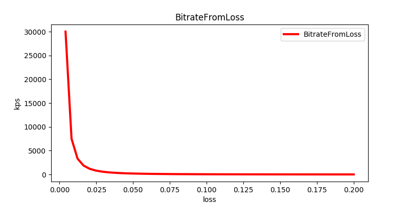

# 基于丢包的带宽控制

这部分分析来自于 `webrtc` 代码，路径为 `src\modules\congestion_controller\goog_cc\loss_based_bandwidth_estimation.cc`，实现的核心类为 `LossBasedBandwidthEstimation`。由于这部分代码注释比较少，而且网上也没有找到相关的参考资料，所以花了比较长的时间研究。其中关于码率更新的部分，部分理解可能不太透彻，也需要有更了解的人能指出。

# 对均值的计算

类功能的核心，是通过对输入信息计算平均值的方式来实现，如在 `LossBasedBandwidthEstimation` 中对 `average_loss_` 和 `average_loss_max_`，也就是平均丢包率和最大平均丢包率的计算，和在 `UpdateAcknowledgedBitrate` 中对最大平均确认码率 `acknowledged_bitrate` 的计算。

但这里并没有使用常规的计算平均值的方法，而是通过指数移动平均值的方法去计算平均值，这样做的好处是不用保存以往所有的数据，而只需要保存次计算后的状态就可以了。

先认识下指数移动平均值 `exponential moving average (EMA)` 公式的定义:

$Y$ 序列的 `EMA` 通过可以递归计算得到：

$$
S_t=\begin{cases}
Y_1,\quad t = 1 \\\\
\alpha \cdot Y_t + (1 - \alpha) \cdot S_{t-1},\quad t>1
\end{cases} \tag{1}
$$


- 系数 $α$ 表示权重下降的程度，它是介于0和1之间的恒定平滑因子。较高的 $α$ 会使较早的观测值更快地降低权重。

- $Y_t$ 是在时段 $t$ 时的值

- $S_t$ 是 `EMA` 在任意时段 $t$ 的值

对 $x$ > 0 时的情况进行变换得到：

$$
\alpha \cdot Y_t + (1 - \alpha) \cdot S_{t-1} => \alpha (Y_t - S_{t-1}) + S_{t-1} \tag{2}
$$

在统计一些计算机性能指标，例如平均进程队列长度或平均CPU利用率时，$α$ 被定义为两次读数之间的时间的函数，以赋予当前读数较大权重而较旧读数较小权重的系数，假设以60秒为窗口，则：

$$
\alpha(t_n - t_{n-1}) = 1 - \exp\left(-\frac{t_n - t_{n-1}}{W \cdot 60}\right) \tag{3}
$$

将公式3替换到公式2中，得到：

$$
\alpha (Y_t - S_{t-1}) + S_{t-1} => \left(1 - \exp\left(-\frac{t_n - t_{n-1}}{W \cdot 60}\right) \right) \left(Y_t - S_{t-1}\right) + S_{t-1} \tag{4}
$$

`LossBasedBandwidthEstimation` 函数的实现就是对以上公式的应用，先计算当前丢包率为 `last_loss_ratio_`，最后计算丢包率的指数移动平均值：

``` cpp
  average_loss_ += ExponentialUpdate(config_.loss_window, time_passed) *
                   (last_loss_ratio_ - average_loss_);
```

换成另一种写法会更清晰一些：

``` cpp
  average_loss_ = ExponentialUpdate(config_.loss_window, time_passed) *
                   (last_loss_ratio_ - average_loss_) + average_loss_;
```

等式左边的 `average_loss_` 就是我们要计算的 $S_t$ ，等式右边的 `ExponentialUpdate` 函数是对公式（3）的实现，`last_loss_ratio_` 也就是 $Y_t$，修改前的 `average_loss_`就是 `S_{t-1}`，正如最开始所说，这是一个递归的过程，之前计算得到的 `average_loss_` 会在下一次更新时用到。

对最大平均丢包率 `average_loss_max_` 的计算也是通过相同的原理。

# 对码率的更新

实现于 `Update`中。这部分有两个核心，一个是阈值的计算，通过该阈值判断当前码率是否应该增加还是减少，另一个核心是码率的增量计算。

首先是关于阈值，这里有两个，一个是用于判断码率是否应该增加的阈值，实现在函数 `loss_increase_threshold` 中，函数通过调用 `LossFromBitrate` 函数实现，从参数得出，该阈值是关于当前码率（`loss_based_bitrate_`，记为 $b$），配置的带宽平衡增量（`loss_bandwidth_balance_increase`，记为 $\lambda$）和配置的带宽平衡指数（`loss_bandwidth_balance_exponent`，记为 $n$）这三个变量的函数。带入`LossFromBitrate` 的公式中，得出结果阈值 $S$：

$$
S = \left(\frac{\lambda}{b}\right)^n \tag{5}
$$

实现中，$\lambda=0.5kps$，$n=0.5$，代入公式后，使用 `matplotlib` 作图，在 $1<b<100$区间内的图像如下：



而在带宽在 $100<b<1000$ 区间内时，得出的结果就已经小于0.07了，如下：


这意味着在当前带宽为100kps时，当前的平均丢包率应该低于7%以后才能继续增加带宽，而带宽越高阈值越低，这个阈值比想象中的低很多。

同样的情况在计算判断码率是否应该减少的阈值时也出现了，因为这时候根据默认配置：

$\lambda=4kps$，$n=0.5$，在码率 $100<b<1000$ 的区间内图像如下：



在码率 $b=800kps$时，阈值丢包率为7%，也就是只要当前丢包率高于7%时，带宽就会减少，这个阈值比想象中的也低了很多。

综合以上情况，如果在使用默认参数的情况下，可能会导致带宽一直被控制在比较低的水平，导致没办法充分利用带宽，所以我猜测在实际使用中应该需要对 $\lambda$ 和 $n$ 值进行调整，以符合实际场景。

另一个核心 是码率的增量计算。在丢包率低于 `loss_increase_threshold` 时，目标码率由计算出的新码率和可能的码率最高值决定，取两者中的最小值，然后与当前码率做比较，再取两者的最大值。

新码率的的计算：

``` cpp
DataRate new_increased_bitrate =
        min_bitrate * GetIncreaseFactor(config_, last_round_trip_time) +
        config_.increase_offset;
```

其中 `increase_offset` 的作用是防止码率变化不会卡住，默认为1kps，而 `GetIncreaseFactor` 函数则是根据当前 `RTT` 计算出一个增长因子，根据默认配置，`RTT` 在范围 [200,800]内时，增长因子是 [1.02, 1.08] 内的一个线性映射，RTT越大，越长因子越小。

可能的最高码率计算：

``` cpp
const DataRate new_increased_bitrate_cap = BitrateFromLoss(
    loss_estimate_for_increase, config_.loss_bandwidth_balance_increase,
    config_.loss_bandwidth_balance_exponent);
```

与我们前面介绍增长阈值时类似，这里的 `BitrateFromLoss` 是 `LossFromBitrate` 的反运算，根据当前平均丢包率，计算出当前可用带宽，默认配置下变化曲线如下：



注意到默认配置下丢包率越过10%以后，带宽就基本降到0，所以非常不合理，再次证明配置需要根据情况进行修改。

在丢包率低于 `loss_decrease_threshold` 时，码率会进行降低，目标码率取新码率和可能的码率最低值中的较大者，然后与当前码率比较，再取两者中的较小者。

新码率通过 `decreased_bitrate` 得到，取当前应答码率和缩减因子的乘积，缩减因子默认为 0.99。

可能的最低码率计算：

``` cpp
const DataRate new_decreased_bitrate_floor = BitrateFromLoss(
    loss_estimate_for_decrease, config_.loss_bandwidth_balance_decrease,
    config_.loss_bandwidth_balance_exponent);
```

这里又用到了 `BitrateFromLoss`，还是用于从丢包率计算出带宽，与前面介绍的没什么不同。

到这里就完成了基于丢包的码率的更新的全部逻辑了。

参考资料：

[Moving average](https://en.wikipedia.org/wiki/Moving_average)